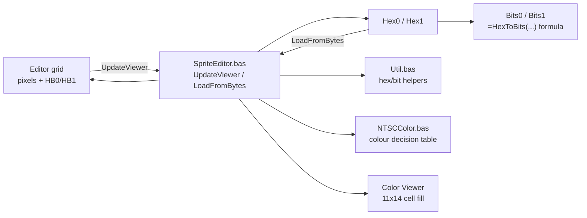

# a2-hires-lab

**An Excel/VBA lab that makes the Apple II hi-res graphics system tangible, built tightly around XekriRedmane's Lode Runner disassembly.**

---


## Vision

Not a general-purpose bitmap editor -- a lab. Each sheet illuminates one layer of the graphics machinery the disassembly documents: how pixels become bytes, how bytes become colors, how the shift tables work, how sprites land on the memory-mapped screen. The workbook is standalone from my `load-runner` disassembly project (misspelling intentional; no shared code, no shared repo) and draws its data and documentation directly from Chapter 3 of `main.nw` from XekriRemane's fantastic project https://github.com/XekriRedmane/lode_runner_reveng.

**Core philosophy:**

- **Sprite-focused, not screen-fragment-focused.** Prior art in this space (see below) treats hi-res as an undifferentiated pixel field. `a2-hires-lab` is built around the game's own unit of meaning -- the 11x14 sprite -- with an inventory, shift mechanics, and memory-map views all keyed to that.
- **Pixels are canonical, bytes are derived.** The editor's primary input is the pixel grid; "Update Viewer" computes bytes from pixels, not the other way around. This was a deliberate correction mid-design: the human-meaningful direction is pixels first.
- **VBA over conditional formatting.** Color rendering runs through named, readable, testable functions (`NTSCColor.PixelColor`, `.ColoredPixel`) rather than being buried in per-cell formulas. The logic needs to be inspectable and eventually portable to `papple2` -- a pile of conditional-formatting rules can't be either.
- **A ground-truth for `papple2`.** The NTSC color rules, once verified by hand against the chapter's own worked figures, are meant to become test fixtures for `papple2`'s `Display.update_hires`, which currently uses a simplified per-pixel model with no neighbor adjacency.
- **Each deliverable stands alone but composes.** The Sprite Editor/Viewer is the foundation; Inventory, Pixel Shifter, Sprite Shifter, and Memory Map Viewer each add a sheet and VBA module without requiring the earlier ones to change shape.

---

## Architecture



### The two-button, idempotent contract

`UpdateViewer` and `LoadFromBytes` are each a pure function of their own inputs -- pixels+HB for one, Hex0/Hex1 for the other -- and each fully overwrites every cell it owns on every run. Nothing accumulates; alternating the two buttons on unchanged data is a no-op. `PixelsToByteValue` is the one conversion function factored out as independently reasoned-about, mirroring how the color decision table itself is factored into `ColoredPixel`/`PixelColor`/`RowColors`.

---

## The colour model

### NTSC Colors

Apple II hires uses two selectable color pairs, chosen per byte via that byte's high bit (Chapter 3 page 7):

| High bit | Odd column | Even column |
|---|---|---|
| clear | Green `RGB(20,245,60)` | Violet `RGB(255,68,253)` |
| set | Orange `RGB(255,106,60)` | Blue `RGB(20,207,253)` |

Kept the name "Violet" for `RGB(255,68,253)` even though it's closer to what's normally called magenta -- that's genuinely what the color looks like on real NTSC hardware (a phase-angle effect of the Apple II's video timing, not a design choice), and it's the name Apple used in the original Apple II Reference Manual and Applesoft's `HCOLOR`. RGB values are the "Standard NTSC CRT Decoding" estimates, not the (more washed-out) Apple IIGS RGB palette.

Byte-boundary behavior: a pixel's color always comes from *its own byte's* high bit, never a neighboring byte's, even for a "colored 0" pixel whose neighbor lighting it up sits in the other byte -- confirmed both in `NTSCColor.bas` and against real hardware sources (the high bit delays that byte's own pixel-clock by half a pixel, which is a per-byte, not per-pixel-pair, effect). On real hardware this delay is also a physical position shift, not just a recolor, so a byte with the high bit set is nudged half a pixel right relative to a neighboring byte without it -- `NTSCColor.bas` reproduces the color correctly but doesn't model that sub-pixel stagger. Not relevant for `a2-hires-lab`, but worth knowing if `papple2`'s `Display.update_hires` ever needs pixel-perfect fidelity at a mixed-high-bit boundary.

### Implementation

`NTSCColor` implements the nearest-neighbor decision table from Chapter 3 page 7: a lit pixel next to another lit pixel is white; a lit pixel alone is colored; an unlit pixel sandwiched between two lit pixels is colored; everything else is black. Two things about it were *not* obvious from the chapter's prose alone and only surfaced by testing against real worked examples:

- **Color depends on the pixel's absolute screen column, not its position within the sprite row.** The NTSC color-subcarrier phase is fixed to the physical screen, not to wherever a sprite is drawn -- which is exactly why the game's own pixel-shift machinery (`COMPUTE_SHIFTED_SPRITE`) has to exist. `RowColors` takes an absolute `iBaseCol` plus true left/right screen neighbors instead of assuming an isolated sprite at column 0.
- **A colored "sandwiched" 0-pixel takes its hue from its flanking 1-bit's column, not its own.** Colouring it from its own (necessarily opposite-parity) column produces alternating stripes for a repeating `0x55`-style byte; real Apple II hi-res renders that as one solid fill. Found by reproducing the chapter's own worked "5"-shaped sprite pixel-for-pixel and noticing the mismatch.

---

## Sprite Table Memory Layout

`sprite_data.asm` stores its 2288 bytes (104 sprites × 11 rows × 2 bytes) *not* as 104 contiguous 22-byte blocks, but "column-major": all 104 sprites' row-0-byte-0 first, then all 104 sprites' row-0-byte-1, and so on through 22 byte-positions. Each byte-position block is exactly 104 bytes.

This is a deliberate trade for the 6502, which has no multiply instruction. Storing sprites contiguously would mean computing `sprite_number * 22` (a small loop or table, done on every single sprite draw) just to find a sprite's data. Storing them byte-position-major means the sprite number is already the exact byte offset within a 104-byte block: `LDA (ptr),Y` with `Y = sprite_number`reads any sprite's byte directly, one instruction, and moving to the next byte-position is a fixed `ADC #$68` (`$68` = 104 decimal) to the pointer. `COMPUTE_SHIFTED_SPRITE` uses exactly this pattern. The trade: no per-sprite address computation, at the cost of a sprite's own bytes being scattered 104 bytes apart from each other rather than adjacent.

---

## Current status

| # | Sheet | Status | Description |
|---|-------|--------|-------------|
| 1 | Sprite Editor/Viewer | **in progress** | Layout, `Util`, `NTSCColor`, `SpriteEditor` all built; first worked sprite verified pixel-for-pixel |
| 2 | Sprite Inventory | planned | All 104 sprites from `sprite_data.asm`, selectable into the editor |
| 3 | Pixel Shifter | planned | 7-bit pattern x shift amount -> two result bytes via table lookups |
| 4 | Sprite Shifter | planned | Full `COMPUTE_SHIFTED_SPRITE` for an 11-row sprite |
| 5 | Memory Map Viewer | idea | Two sheets showing HGR1/HGR2 pixel/color state |

Deliverable 1's remaining open items: verify the second (mixed-byte1) worked sprite from page 8, verify the `HB0 != HB1` byte-boundary case, and decide where masked-hex display columns live in the shipped layout (see `TODO.md`).

**Build mechanic:** the sheet layout is generated (`openpyxl`) and the VBA modules are authored as plain-text `.bas` files, imported into Excel by hand rather than fabricated as a binary `.xlsm` -- see Technical notes below for why. Confirmed working round-trip: a real Excel-saved `.xlsm`'s VBA source can be read back losslessly via `oletools`/`olevba`, which is how future sessions read the modules directly from `a2-hires-lab.xlsm` instead of needing separate `.bas` copies in the filesdump.

---

## Settled decisions

- **VBA macros with explicit cell-coloring code, not conditional formatting.** Keeps the color logic readable and testable as named functions, not buried in per-cell formulas (see Prior art).
- **Pixels are canonical, bytes are derived.** "Update Viewer" (pixels -> bytes) is the primary direction; "Load from Bytes" is the reverse, for pasted or inventory-sourced data.
- **Bits0/Bits1 are formulas (`=HexToBits(...)`), not macro output.** One less thing the buttons need to own, and they stay live even if Hex0/Hex1 are hand-edited.
- **Colour depends on absolute screen column, not sprite-local position.** `RowColors` generalized mid-session to take `iBaseCol` and true neighbors once it was clear the sprite's own shift machinery already assumes this.
- **A colored 0-pixel inherits its hue from its flanking 1-bit, not its own column.** See Architecture above; confirmed against the chapter's own worked sprite, not just the short illustrative fragments.
- **Both buttons are idempotent by construction.** Full overwrite of every owned cell from current inputs, every run -- no accumulation, no half-updated state.
- **`Hex0`/`Hex1` store the byte as the game actually holds it (high bit included), not as the chapter prints it.** E.g. the chapter's `0x55` is `0xD5` in `Hex0` once `HB0` defaults to 1. A known, minor mismatch for eyeballing against the PDF -- not a bug (see `TODO.md`).
- **Sheet layout as generated `.xlsx` + hand-imported `.bas` text modules, not a fabricated `.xlsm`.** Neither this environment nor LibreOffice can reliably emit a genuine Excel-compatible VBA binary from outside Excel; importing separately-authored text modules is reliable and keeps VBA source under version control as plain text.
- **`HB0`/`HB1` default to 1** in a freshly laid-out editor, matching what the game actually does at runtime (`sprite_data.asm`'s raw bytes are 7-bit, 0x00-0x7F; the high bit is OR'd in elsewhere in the game's own pipeline).

---

## Relation to sibling projects

**`load-runner`:** `a2-hires-lab` draws its sprite data and Chapter 3 documentation from the disassembly project but is intentionally standalone -- no shared code, no shared repo. The relationship is one-directional: the disassembly is a data/documentation source, not a dependency.

**`papple2`:** the VBA color rules, once fully verified against the chapter's worked examples, are meant to become test fixtures for `papple2`'s `Display.update_hires`, which currently uses a simplified per-pixel color model without the neighbor-adjacency rules this project has been working out by hand. That handoff hasn't happened yet -- it's the natural next bridge once Deliverable 1 is fully hardened (see `TODO.md`'s `papple2` integration section).

---

## Prior art

François Vander Linden's **`bitmap_creator`** (Excel, formula-driven, no VBA) validates that "Excel + colored cells" works for hi-res visualization, and its documented color rules confirm our NTSC decision table independently. It's not a basis for this project: it's a general 70x192-pixel screen-fragment editor with no notion of sprites, no game-data awareness, and its color logic lives in conditional-formatting formulas rather than readable code.

---

## Running

```bash
make setup        # create venv, install dependencies (papple2-side, not yet used by the workbook)
make filesdump     # regenerate tmp/filesdump.txt from manifest.lst, for LLM sessions
```

The workbook itself has no build step yet: open `a2-hires-lab.xlsm` directly in Excel. `Update Viewer` and `Load from Bytes` are Form Control buttons on the `Sprite Editor-Viewer` sheet, wired to `SpriteEditor.UpdateViewer` / `SpriteEditor.LoadFromBytes`.

### How correctness is currently verified

There's no automated test suite yet. Correctness is checked by hand against Chapter 3 page 8's two worked sprite examples: type the pixel data into the editor (`HB0`/`HB1` default to 1), click `Update Viewer`, and compare the color viewer against the chapter's own rendered figure, pixel for pixel. The first ("5"-shaped, `byte1` always `0x00`) sprite is confirmed correct; the second (mixed-`byte1`) sprite and the `HB0 != HB1` byte-boundary case are still open. Once fixtures are derived for `papple2`, this becomes an automated `pytest` suite on that side instead.

---

## Technical notes & gotchas

- **A multi-area named range needs its sheet name repeated on every area, not just the first.** `ViewerGrid` (`B17:H27,J17:P27`) silently lost its second area on save until both areas were sheet-qualified -- Excel strips the whole name on open with no error at save time ("Reparaturen"/repair dialog instead).
- **`Hex0`/`Hex1` include the high bit; the chapter's printed byte values don't.** Not a bug -- see Settled decisions -- but easy to trip over when comparing against the PDF directly.
- **Reading VBA back out of a `.xlsm` via `oletools`/`olevba` only works against a file that's genuinely been through Excel.** Confirmed reliable, byte-for-byte, against a real Excel-saved file. A file with freshly-authored-but-never-opened-in-Excel Basic code (tried via LibreOffice UNO scripting) does not contain a real `vbaProject.bin` and yields nothing -- this is a limitation of authoring VBA outside Excel, not of the reading tool.
- **`BITAND`-based masking formulas make Excel silently add a hidden compatibility defined name** (e.g. `_xleta.AND`). Harmless, Excel-managed -- don't try to keep it in sync with anything by hand.
