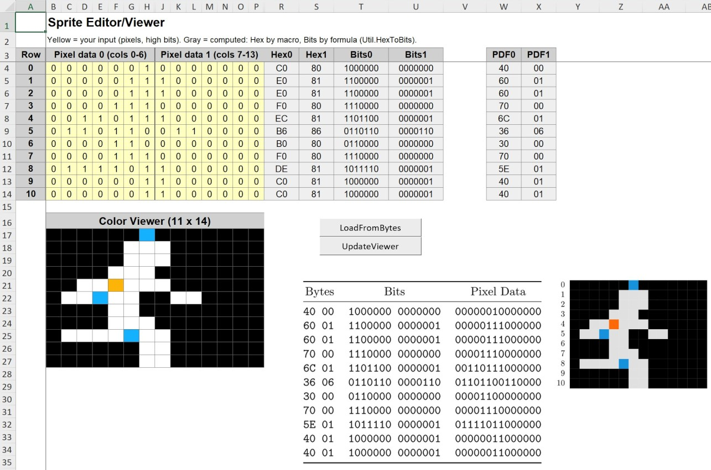
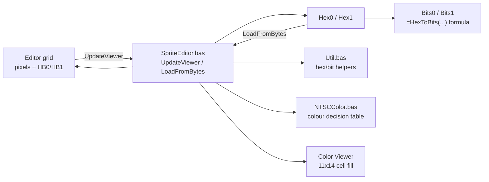
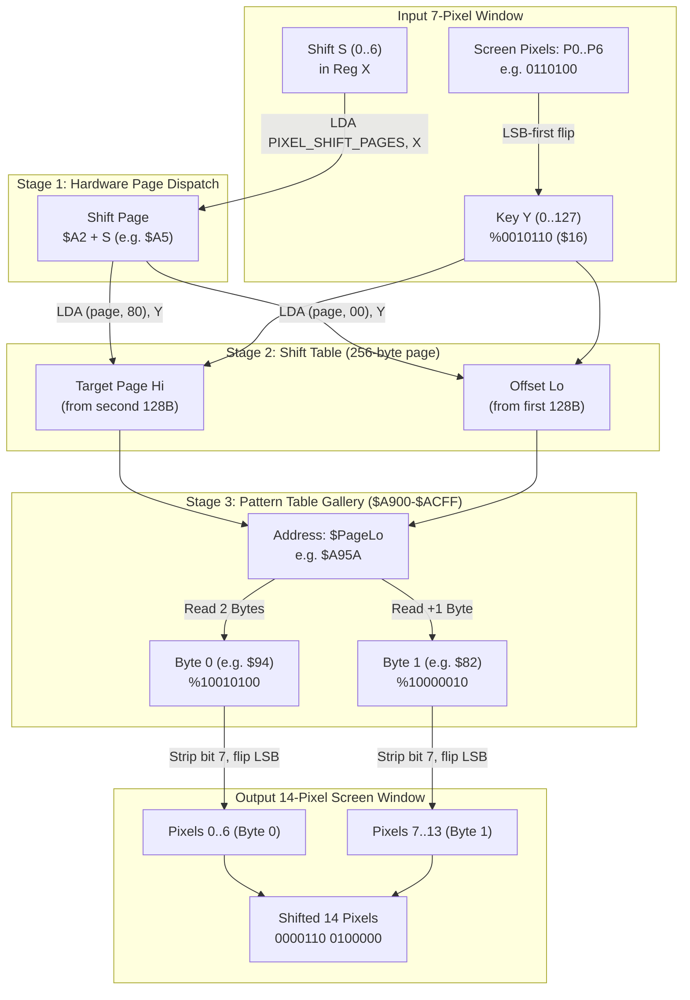
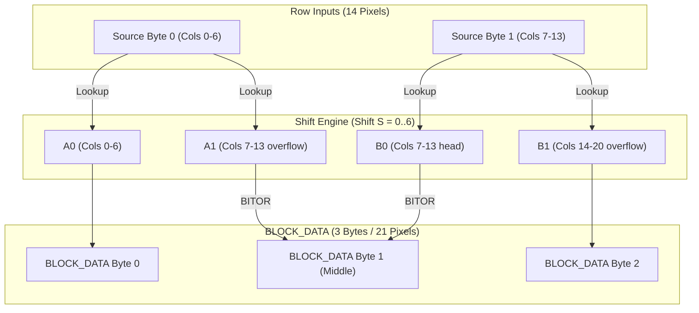

# a2-hires-lab

**An Excel/VBA lab that makes the Apple II hi-res graphics system tangible, built tightly around XekriRedmane's Lode Runner disassembly.**

---



## Table of Contents

- [Vision](#vision)
- [Architecture](#architecture)
  - [The two-button, idempotent contract](#the-two-button-idempotent-contract)
- [The colour model](#the-colour-model)
  - [NTSC Colors](#ntsc-colors)
  - [Implementation](#implementation)
- [Sprite Table Memory Layout](#sprite-table-memory-layout)
- [The Shift Engine (Phase 3)](#the-shift-engine-phase-3)
  - [The Core Problem: Runtime Shifting vs. Table Lookups](#the-core-problem-runtime-shifting-vs-table-lookups)
  - [Why Exactly 512 Unique Patterns?](#why-exactly-512-unique-patterns)
  - [The Shift Table Split Architecture](#the-shift-table-split-architecture)
    - [Concrete Mapping Model (Shift 0 Example)](#concrete-mapping-model-shift-0-example)
  - [Pipeline: From Screen Pixels to Shifted Output](#pipeline-from-screen-pixels-to-shifted-output)
  - [Visual Mechanics Flow](#visual-mechanics-flow)
  - [Educational Takeaways & Traps](#educational-takeaways--traps)
- [The Sprite Shifter Engine (Phase 4)](#the-sprite-shifter-engine-phase-4)
  - [From Sprite Rows to BLOCK_DATA](#from-sprite-rows-to-block_data)
  - [The Middle-Byte Merge Contract](#the-middle-byte-merge-contract)
  - [Screen Bitfield Reflection](#screen-bitfield-reflection)
- [Architectural Analysis: The Indirection Mystery & Direct Table Optimization](#architectural-analysis-the-indirection-mystery--direct-table-optimization)
  - [The As-Built 2-Stage Design](#the-as-built-2-stage-design)
  - [The Direct 1-Stage Alternative](#the-direct-1-stage-alternative)
  - [Why Did Doug Opt for Indirection?](#why-did-doug-opt-for-indirection)
- [Current status](#current-status)
- [Settled decisions](#settled-decisions)
- [Relation to sibling projects](#relation-to-sibling-projects)
- [Prior art](#prior-art)
- [Running](#running)
  - [How correctness is currently verified](#how-correctness-is-currently-verified)
- [Technical notes & gotchas](#technical-notes--gotchas)

---

## Vision

Not a general-purpose bitmap editor -- a lab. Each sheet illuminates one layer of the graphics machinery the disassembly documents: how pixels become bytes, how bytes become colors, how the shift tables work, how sprites land on the memory-mapped screen. The workbook is standalone from my `load-runner` disassembly project (misspelling intentional; no shared code, no shared repo) and draws its data and documentation directly from Chapter 3 of `main.nw` from XekriRemane's fantastic project https://github.com/XekriRedmane/lode_runner_reveng.

**Core philosophy:**

- **Sprite-focused, not screen-fragment-focused.** Prior art in this space (see below) treats hi-res as an undifferentiated pixel field. `a2-hires-lab` is built around the game's own unit of meaning -- the 11x14 sprite -- with an inventory, shift mechanics, and memory-map views all keyed to that.
- **Pixels are canonical, bytes are derived.** The editor's primary input is the pixel grid; "Update Viewer" computes bytes from pixels, not the other way around. This was a deliberate correction mid-design: the human-meaningful direction is pixels first.
- **VBA over conditional formatting.** Color rendering runs through named, readable, testable functions (`NTSCColor.PixelColor`, `.ColoredPixel`) rather than being buried in per-cell formulas. The logic needs to be inspectable and eventually portable to `papple2` -- a pile of conditional-formatting rules can't be either.
- **A ground-truth for `papple2`.** The NTSC color rules, once verified by hand against the chapter's own worked figures, are meant to become test fixtures for `papple2`'s `Display.update_hires`, which currently uses a simplified per-pixel model with no neighbor adjacency.
- **Each deliverable stands alone but composes.** The Sprite Editor/Viewer is the foundation; Inventory, Pixel Shifter, Sprite Shifter, and Memory Map Viewer each add a sheet and VBA module without requiring the earlier ones to change shape.

---

## Architecture



### The two-button, idempotent contract

`UpdateViewer` and `LoadFromBytes` are each a pure function of their own inputs -- pixels+HB for one, Hex0/Hex1 for the other -- and each fully overwrites every cell it owns on every run. Nothing accumulates; alternating the two buttons on unchanged data is a no-op. `PixelsToByteValue` is the one conversion function factored out as independently reasoned-about, mirroring how the color decision table itself is factored into `ColoredPixel`/`PixelColor`/`RowColors`.

---

## The colour model

### NTSC Colors

Apple II hires uses two selectable color pairs, chosen per byte via that byte's high bit (Chapter 3 page 7):

| High bit | Odd column | Even column |
|---|---|---|
| clear | Green `RGB(20,245,60)` | Violet `RGB(255,68,253)` |
| set | Orange `RGB(255,106,60)` | Blue `RGB(20,207,253)` |

Kept the name "Violet" for `RGB(255,68,253)` even though it's closer to what's normally called magenta -- that's genuinely what the color looks like on real NTSC hardware (a phase-angle effect of the Apple II's video timing, not a design choice), and it's the name Apple used in the original Apple II Reference Manual and Applesoft's `HCOLOR`. RGB values are the "Standard NTSC CRT Decoding" estimates, not the (more washed-out) Apple IIGS RGB palette.

Byte-boundary behavior: a pixel's color always comes from *its own byte's* high bit, never a neighboring byte's, even for a "colored 0" pixel whose neighbor lighting it up sits in the other byte -- confirmed both in `NTSCColor.bas` and against real hardware sources (the high bit delays that byte's own pixel-clock by half a pixel, which is a per-byte, not per-pixel-pair, effect). On real hardware this delay is also a physical position shift, not just a recolor, so a byte with the high bit set is nudged half a pixel right relative to a neighboring byte without it -- `NTSCColor.bas` reproduces the color correctly but doesn't model that sub-pixel stagger. Not relevant for `a2-hires-lab`, but worth knowing if `papple2`'s `Display.update_hires` ever needs pixel-perfect fidelity at a mixed-high-bit boundary.

### Implementation

`NTSCColor` implements the nearest-neighbor decision table from Chapter 3 page 7: a lit pixel next to another lit pixel is white; a lit pixel alone is colored; an unlit pixel sandwiched between two lit pixels is colored; everything else is black. Two things about it were *not* obvious from the chapter's prose alone and only surfaced by testing against real worked examples:

- **Color depends on the pixel's absolute screen column, not its position within the sprite row.** The NTSC color-subcarrier phase is fixed to the physical screen, not to wherever a sprite is drawn -- which is exactly why the game's own pixel-shift machinery (`COMPUTE_SHIFTED_SPRITE`) has to exist. `RowColors` takes an absolute `iBaseCol` plus true left/right screen neighbors instead of assuming an isolated sprite at column 0.
- **A colored "sandwiched" 0-pixel takes its hue from its flanking 1-bit's column, not its own.** Colouring it from its own (necessarily opposite-parity) column produces alternating stripes for a repeating `0x55`-style byte; real Apple II hi-res renders that as one solid fill. Found by reproducing the chapter's own worked "5"-shaped sprite pixel-for-pixel and noticing the mismatch.

---

## Sprite Table Memory Layout

`sprite_data.asm` stores its 2288 bytes (104 sprites × 11 rows × 2 bytes) *not* as 104 contiguous 22-byte blocks, but "column-major": all 104 sprites' row-0-byte-0 first, then all 104 sprites' row-0-byte-1, and so on through 22 byte-positions. Each byte-position block is exactly 104 bytes.

This is a deliberate trade for the 6502, which has no multiply instruction. Storing sprites contiguously would mean computing `sprite_number * 22` (a small loop or table, done on every single sprite draw) just to find a sprite's data. Storing them byte-position-major means the sprite number is already the exact byte offset within a 104-byte block: `LDA (ptr),Y` with `Y = sprite_number`reads any sprite's byte directly, one instruction, and moving to the next byte-position is a fixed `ADC #$68` (`$68` = 104 decimal) to the pointer. `COMPUTE_SHIFTED_SPRITE` uses exactly this pattern. The trade: no per-sprite address computation, at the cost of a sprite's own bytes being scattered 104 bytes apart from each other rather than adjacent.

---

## The Shift Engine (Phase 3)

### The Core Problem: Runtime Shifting vs. Table Lookups

The Apple II screen renders pixels least-significant-bit (LSB) first. Moving an 11x14 sprite horizontally by arbitrary pixel offsets requires shifting its 7-pixel byte windows to the right by 0 to 6 pixels. When a 7-pixel pattern shifts right, it overflows into a second screen byte, spanning a 14-pixel wide, 2-byte field.

On a 1 MHz 6502, performing 14-bit runtime bit-shifts across 22 bytes per sprite at 60 Hz would consume excessive CPU cycles. Doug Smith solved this by performing **no runtime bit-shifting at all**. Instead, *Lode Runner* uses a pre-calculated two-stage dictionary lookup:

$$\text{Input 7-Pixel Pattern } (Y) + \text{Shift Amount } (S) \longrightarrow \text{Ready-to-blit Two Screen Bytes } (B_0, B_1)$$

### Why Exactly 512 Unique Patterns?

A naive lookup table mapping every 7-bit input ($2^7 = 128$) across 7 shift positions ($0 \dots 6$) would require $128 \times 7 = 896$ two-byte pairs. However, many different input-shift combinations produce identical visual outputs on screen (e.g. a single pixel at position 0 shifted by 4 looks identical to a single pixel at position 4 shifted by 0).

*Lode Runner* stores only mathematically unique 14-pixel visual outcomes. Shifting a 7-pixel window by 0 to 6 positions only ever populates columns 0 to 12 of the 14-pixel field (column 13 is never touched). Counting every valid output pattern where the distance between the first and last lit pixel is at most 6 yields:

- **Width 1:** 1 shape $\times\ 13$ positions $= 13$
- **Width 2:** 1 shape ($2^0$) $\times\ 12$ positions $= 12$
- **Width 3:** 2 shapes ($2^1$) $\times\ 11$ positions $= 22$
- **Width 4:** 4 shapes ($2^2$) $\times\ 10$ positions $= 40$
- **Width 5:** 8 shapes ($2^3$) $\times\ 9$ positions $= 72$
- **Width 6:** 16 shapes ($2^4$) $\times\ 8$ positions $= 128$
- **Width 7:** 32 shapes ($2^5$) $\times\ 7$ positions $= 224$

Summing these gives **511 unique non-zero shapes**. Adding the 1 all-zero pattern brings the grand total to **exactly 512 unique visual outcomes**. At 2 bytes per entry, `pixel_pattern_table.asm` requires exactly 1,024 bytes, filling four consecutive 256-byte 6502 pages (`$A900` to `$ACFF`) with zero padding.

### The Shift Table Split Architecture

To locate the 2-byte target in the 512-entry gallery, the engine consults `pixel_shift_table.asm`. Because 6502 index registers (`X`, `Y`) are 8-bit ($0 \dots 255$), indexed addressing cannot load a 16-bit address directly. 

Each shift amount ($0 \dots 6$) is given its own 256-byte page in memory (`$A200` to `$A800`), split into two 128-byte halves:
1. **Low Bytes (Offsets):** The first 128 bytes of the page (`$00 \dots $7F`), containing the target offset within `$A900`–`$ACFF`.
2. **High Bytes (Pages):** The second 128 bytes of the page (`$80 \dots $FF`), containing the target page high byte (`$A9`, `$AA`, `$AB`, or `$AC`).

The shift page base is looked up via `PIXEL_SHIFT_PAGES` (`$84C1`: `$A2, $A3, $A4, $A5, $A6, $A7, $A8`). The 6502 retrieves the 16-bit address with two single-cycle indexed loads:
```assembly
LDA (TMP_PTR), Y       ; TMP_PTR=$A200..$A800 -> reads target Offset (Lo)
LDA (TMP_PTR+128), Y   ; TMP_PTR=$A280..$A880 -> reads target Page (Hi)
```

#### Concrete Mapping Model (Shift 0 Example)

Viewing these split arrays as a unified 3-column map shows how the 7-bit key index directly resolves into the 16-bit target address:

| Key: Input Byte (Binary) | Value 1: Low Byte (Offset) | Value 2: High Byte (Page) | Resulting Target Address |
| :--- | :--- | :--- | :--- |
| `%00000000` (0) | `$00` (Index 0) | `$A9` (Index 128) | `$A900` |
| `%00000001` (1) | `$02` (Index 1) | `$A9` (Index 129) | `$A902` |
| `%00000010` (2) | `$04` (Index 2) | `$A9` (Index 130) | `$A904` |
| `%00000011` (3) | `$12` (Index 3) | `$A9` (Index 131) | `$A912` |
| ... | ... | ... | ... |
| `%00100000` (32) | `$0C` (Index 32) | `$A9` (Index 160) | `$A90C` |
| `%00100001` (33) | `$02` (Index 33) | `$AA` (Index 161) | `$AA02` |
| `%00100010` (34) | `$84` (Index 34) | `$A9` (Index 162) | `$A984` |
| `%00100011` (35) | `$12` (Index 35) | `$AA` (Index 163) | `$AA12` |

Starting at input index 33, the High Byte alternates between `$A9` and `$AA` because the target shapes cross the physical 256-byte hardware page boundary in memory.

### Pipeline: From Screen Pixels to Shifted Output

The entire lookup and conversion follows a strict 5-stage pipeline:

1. **Input Pixel Reversal:** The visual 7-pixel input window ($P_0 \dots P_6$) is reversed into 6502 storage bit order (`%b6..b0`) to produce key $Y \in [0..127]$.
2. **Page Dispatch:** The shift amount $S \in [0..6]$ indexes `PIXEL_SHIFT_PAGES` to select table page `$A2 + S`.
3. **Shift Table Lookup:** Key $Y$ indexes the first 128 bytes to read `Lo` and the second 128 bytes (`Y + 128`) to read `Hi`.
4. **Pattern Table Resolution:** Target address `$HiLo` reads Output Byte 0, and `$HiLo + 1` reads Output Byte 1 from `$A900`–`$ACFF`.
5. **Output Unpacking:** Bit 7 (NTSC color bit) is masked off each byte, and bits 0–6 are reversed back to visual screen pixel order, yielding the shifted 14-pixel field.

### Visual Mechanics Flow



### Educational Takeaways & Traps

- **Pixels vs. Storage Bits:** On the Apple II, pixels are drawn left-to-right on screen, but stored least-significant-bit first ($P_0 = \text{bit } 0, P_6 = \text{bit } 6$). For example, pixels `0110100` reverse to `%0010110` ($22$ decimal). Looking up patterns using screen pixel order rather than storage bit order will hit the wrong table entries.
- **Pattern Table Returns Bytes, Not Pixels:** `pixel_pattern_table.asm` does not store pixel bitstrings. It holds raw screen bytes with bit 7 forced to $1$ (for high-bit NTSC orange/blue artifacting). To display or inspect them as pixels, bit 7 must be masked off and the remaining 7 bits reversed back to screen order.
- **Hardware Page Bouncing:** The High Bytes in `pixel_shift_table.asm` bounce between `$A9`, `$AA`, `$AB`, and `$AC` because target addresses cross physical 256-byte boundaries in RAM as shift offsets grow. Storing page and offset in split arrays eliminates 16-bit pointer arithmetic during gameplay.

---

## The Sprite Shifter Engine (Phase 4)

### From Sprite Rows to BLOCK_DATA

While the Pixel Shifter operates on an isolated 7-pixel input byte, a complete Lode Runner sprite consists of 11 rows $\times$ 2 bytes (14 screen pixel columns). When shifted horizontally by $0 \dots 6$ pixels, the sprite expands from 2 screen bytes to **3 screen bytes** (up to 21 pixel columns).

In the game engine, `COMPUTE_SHIFTED_SPRITE` (Chapter 3, §3.3) renders the shifted sprite into a dedicated 33-byte staging buffer in zero page called `BLOCK_DATA` (11 rows $\times$ 3 bytes). The worksheet `Sprite Shifter` models this complete pipeline live with zero macro execution, using direct 2D matrix lookups into `pixel_shift_table.asm` and `pixel_pattern_table.asm`.

For each row $r \in [0 \dots 10]$:
1. Source `Byte 0` is shifted by $S$ to yield the two-byte pair $(A_0, A_1)$.
2. Source `Byte 1` is shifted by $S$ to yield the two-byte pair $(B_0, B_1)$.
3. The three destination bytes in `BLOCK_DATA` are assembled:
   $$\text{Byte } 0 = A_0$$
   $$\text{Byte } 1 = A_1 \text{ BITOR } B_0$$
   $$\text{Byte } 2 = B_1$$



### The Middle-Byte Merge Contract

The central insight of the horizontal sprite expansion is the overlapping middle byte (`BLOCK_DATA` Byte 1):
- $A_1$ holds the rightward overflow of shifted Byte 0.
- $B_0$ holds the beginning of shifted Byte 1.

Because both bytes represent disjoint or complementary visual pixel positions within screen columns 7–13, merging them requires a bitwise logical OR. In the original 6502 assembly:
```assembly
ORA (TMP_PTR), Y       ; ORs B0 head with A1 overflow already in Accumulator
```
In Excel, this is computed directly via `=BITOR(A1, B0)`.

**High-Bit Preservation:** A crucial consequence of the pattern table format is that every output byte in `pixel_pattern_table.asm` has its high bit (bit 7) set to $1$. When $A_1$ and $B_0$ are merged with `BITOR`, bit 7 remains $1$ (`1 OR 1 = 1`). The merged middle byte automatically retains the required Apple II high-bit color palette flag without requiring special-case bit masking.

### Screen Bitfield Reflection

To make the resulting 33-byte `BLOCK_DATA` buffer tangible, `Sprite Shifter` unpacks each row across a 21-column screen bitfield (`AA6:AY16`):
1. Bit 7 is masked off each of the 3 bytes (`BITAND(byte, 127)`).
2. The remaining 7 bits are reversed back to Apple II LSB-first screen pixel order.
3. The resulting $3 \times 7 = 21$ bits are displayed in individual cells, grouped visually into three screen bytes (`AA:AG`, `AI:AO`, `AQ:AW`).

Adjusting the shift cell $S$ from $0$ to $6$ allows immediate inspection of the sprite gliding smoothly across byte boundaries into the third byte.

---

## Architectural Analysis: The Indirection Mystery & Direct Table Optimization

During the construction of the Phase 4 lab, a third evaluation block was implemented on `Pixel Shifter` using the reflowed sheet `Pixel Shift Pattern Table`. This surfaced an unexpected architectural finding regarding Doug Smith's table design.

### The As-Built 2-Stage Design

In the game's disassembled code, looking up a shifted byte pair uses two distinct tables:
1. `PIXEL_SHIFT_TABLE` (`$A200`–`$A8FF`): 7 pages of 256 bytes = **1,792 bytes**. Each page contains 128 offset bytes and 128 page bytes, together forming a 16-bit pointer into RAM.
2. `PIXEL_PATTERN_TABLE` (`$A900`–`$ACFF`): 512 entries $\times$ 2 bytes = **1,024 bytes**, containing the 512 unique visual patterns.

**Total table memory footprint: 2,816 bytes.**

### The Direct 1-Stage Alternative

Consider the total domain of unique inputs:
- 128 possible 7-bit pattern inputs ($0 \dots 127$).
- 7 shift amounts ($0 \dots 6$).
- Total combinations = $128 \times 7 = 896$ shift outcomes.

Since each shift outcome produces exactly 2 screen bytes ($B_0$ and $B_1$), storing the target bytes **directly** would require:
$$896 \times 2 = \mathbf{1{,}792 \text{ bytes}}$$

Notice that this is **the exact same size as `PIXEL_SHIFT_TABLE` alone**. 

Because each shift amount page in memory is 256 bytes wide, the 6502 could store the actual output bytes directly in place of the pointers:
- First 128 bytes (`$00 \dots $7F`): Output Byte 0 ($B_0$)
- Second 128 bytes (`$80 \dots $FF`): Output Byte 1 ($B_1$)

The 6502 lookup routine would then become:
```assembly
LDA (TMP_PTR), Y       ; reads Output Byte 0 directly!
...
LDA (TMP_PTR+128), Y   ; reads Output Byte 1 directly!
```

**Concrete Savings of the Direct Model:**
1. **Memory:** Completely eliminates `PIXEL_PATTERN_TABLE`, saving **1,024 bytes of RAM** (over 1 KB on a 48 KB / 64 KB Apple II system).
2. **Speed:** Eliminates an entire stage of indirect 16-bit address resolution in the hot inner loop of sprite rendering, saving multiple 6502 CPU cycles per row.

### Why Did Doug Opt for Indirection?

If a direct 1,792-byte table is smaller and faster, why did the disassembly use the two-stage dictionary indirection? Three historical and engineering hypotheses emerge:

1. **Evolutionary / Generative Pipeline:** Doug Smith generated the 512 unique visual pattern gallery first as a mathematical proof of hi-res pattern compression. When building the shift engine, his external table generator was written to emit indices pointing into that gallery rather than flattening the final pairs into the shift pages.
2. **Planned Collision or Masking Reuse:** In early design iterations, having a unique index (0..511) for every visual shape on screen was likely intended for fast collision detection, bounding-box checks, or background tile masking. If that feature was later refactored out or simplified, the underlying dictionary structure remained.
3. **The "Compression Intuition" Trap:** It is easy to assume that reducing 896 possibilities to 512 unique entries saves space. However, because the pointers themselves require 2 bytes per entry (16 bits), the pointer table consumes $896 \times 2 = 1{,}792$ bytes. Storing pointers into a 1,024-byte dictionary costs $1{,}792 + 1{,}024 = 2{,}816$ bytes, whereas storing the uncompressed target bytes directly costs only $1{,}792$ bytes.

This lab proves that the entire 2-stage dictionary can be collapsed into a single, direct 1,792-byte table without losing a single bit of functionality.

---

## Current status

| # | Sheet | Status | Description |
|---|-------|--------|-------------|
| 1 | Sprite Editor/Viewer | complete | Layout, `Util`, `NTSCColor`, `SpriteEditor` all built; verified pixel-for-pixel |
| 2 | Sprite Inventory | complete | Core machinery (`SPRITE_DATA` reflow table, address table, load macro) built; dropdown UI postponed |
| 3 | Pixel Shifter | complete | Reorganized 7-shift unified map and direct 2-stage dictionary lookup (`PixelShiftPages` -> `pixel_shift_table.asm` -> `pixel_pattern_table.asm`) |
| 4 | Sprite Shifter | complete | Full 11-row `COMPUTE_SHIFTED_SPRITE` engine, middle-byte `BITOR` merge, 21-column screen bitfield, and direct lookup analysis |
| 5 | Memory Map Viewer | idea | Two sheets showing HGR1/HGR2 pixel/color state |

**Build mechanic:** the sheet layout is generated (`openpyxl`) and the VBA modules are authored as plain-text `.bas` files, imported into Excel by hand rather than fabricated as a binary `.xlsm` -- see Technical notes below for why. Confirmed working round-trip: a real Excel-saved `.xlsm`'s VBA source can be read back losslessly via `oletools`/`olevba`, which is how future sessions read the modules directly from `a2-hires-lab.xlsm` instead of needing separate `.bas` copies in the filesdump.

---

## Settled decisions

- **VBA macros with explicit cell-coloring code, not conditional formatting.** Keeps the color logic readable and testable as named functions, not buried in per-cell formulas (see Prior art).
- **Pixels are canonical, bytes are derived.** "Update Viewer" (pixels -> bytes) is the primary direction; "Load from Bytes" is the reverse, for pasted or inventory-sourced data.
- **Bits0/Bits1 are formulas (`=HexToBits(...)`), not macro output.** One less thing the buttons need to own, and they stay live even if Hex0/Hex1 are hand-edited.
- **Colour depends on absolute screen column, not sprite-local position.** `RowColors` generalized mid-session to take `iBaseCol` and true neighbors once it was clear the sprite's own shift machinery already assumes this.
- **A colored 0-pixel inherits its hue from its flanking 1-bit, not its own column.** See Architecture above; confirmed against the chapter's own worked sprite, not just the short illustrative fragments.
- **Both buttons are idempotent by construction.** Full overwrite of every owned cell from current inputs, every run -- no accumulation, no half-updated state.
- **`Hex0`/`Hex1` store the byte as the game actually holds it (high bit included), not as the chapter prints it.** E.g. the chapter's `0x55` is `0xD5` in `Hex0` once `HB0` defaults to 1. A known, minor mismatch for eyeballing against the PDF -- not a bug (see `TODO.md`).
- **Sheet layout as generated `.xlsx` + hand-imported `.bas` text modules, not a fabricated `.xlsm`.** Neither this environment nor LibreOffice can reliably emit a genuine Excel-compatible VBA binary from outside Excel; importing separately-authored text modules is reliable and keeps VBA source under version control as plain text.
- **`HB0`/`HB1` default to 1** in a freshly laid-out editor, matching what the game actually does at runtime (`sprite_data.asm`'s raw bytes are 7-bit, 0x00-0x7F; the high bit is OR'd in elsewhere in the game's own pipeline).
- **Direct table access for Pixel Shifting.** Shift lookups route directly through `PIXEL_SHIFT_PAGES` into `pixel_shift_table.asm` and `pixel_pattern_table.asm` rather than relying on intermediate display representations, keeping logic faithful to 6502 memory architecture.
- **Middle byte `BITOR` automatically preserves color bit.** Merging shifted byte overflow ($A_1$) with shifted byte head ($B_0$) via `BITOR` naturally maintains bit 7 as 1 without requiring additional bit manipulation.

---

## Relation to sibling projects

**`load-runner`:** `a2-hires-lab` draws its sprite data and Chapter 3 documentation from the disassembly project but is intentionally standalone -- no shared code, no shared repo. The relationship is one-directional: the disassembly is a data/documentation source, not a dependency. Architectural findings from this lab (such as the 1,792-byte direct lookup optimization) feed back into the `load-runner` literate documentation.

**`papple2`:** the VBA color rules, once fully verified against the chapter's worked examples, are meant to become test fixtures for `papple2`'s `Display.update_hires`, which currently uses a simplified per-pixel color model without the neighbor-adjacency rules this project has been working out by hand. That handoff hasn't happened yet -- it's the natural next bridge once Deliverable 1 is fully hardened (see `TODO.md`'s `papple2` integration section).

---

## Prior art

François Vander Linden's **`bitmap_creator`** (Excel, formula-driven, no VBA) validates that "Excel + colored cells" works for hi-res visualization, and its documented color rules confirm our NTSC decision table independently. It's not a basis for this project: it's a general 70x192-pixel screen-fragment editor with no notion of sprites, no game-data awareness, and its color logic lives in conditional-formatting formulas rather than readable code.

---

## Running

```bash
make setup        # create venv, install dependencies (papple2-side, not yet used by the workbook)
make filesdump     # regenerate tmp/filesdump.txt from manifest.lst, for LLM sessions
```

The workbook itself has no build step yet: open `a2-hires-lab.xlsm` directly in Excel. `Update Viewer` and `Load from Bytes` are Form Control buttons on the `Sprite Editor-Viewer` sheet, wired to `SpriteEditor.UpdateViewer` / `SpriteEditor.LoadFromBytes`.

### How correctness is currently verified

There's no automated test suite yet. Correctness is checked by hand against Chapter 3 page 8's two worked sprite examples: type the pixel data into the editor (`HB0`/`HB1` default to 1), click `Update Viewer`, and compare the color viewer against the chapter's own rendered figure, pixel for pixel. The first ("5"-shaped, `byte1` always `0x00`) sprite is confirmed correct; the second (mixed-`byte1`) sprite and the `HB0 != HB1` byte-boundary case are still open. Once fixtures are derived for `papple2`, this becomes an automated `pytest` suite on that side instead.

---

## Technical notes & gotchas

- **A multi-area named range needs its sheet name repeated on every area, not just the first.** `ViewerGrid` (`B17:H27,J17:P27`) silently lost its second area on save until both areas were sheet-qualified -- Excel strips the whole name on open with no error at save time ("Reparaturen"/repair dialog instead).
- **`Hex0`/`Hex1` include the high bit; the chapter's printed byte values don't.** Not a bug -- see Settled decisions -- but easy to trip over when comparing against the PDF directly.
- **Reading VBA back out of a `.xlsm` via `oletools`/`olevba` only works against a file that's genuinely been through Excel.** Confirmed reliable, byte-for-byte, against a real Excel-saved file. A file with freshly-authored-but-never-opened-in-Excel Basic code (tried via LibreOffice UNO scripting) does not contain a real `vbaProject.bin` and yields nothing -- this is a limitation of authoring VBA outside Excel, not of the reading tool.
- **`BITAND`-based masking formulas make Excel silently add a hidden compatibility defined name** (e.g. `_xleta.AND`). Harmless, Excel-managed -- don't try to keep it in sync with anything by hand.

---

## License and Attribution

This project incorporates disassembly data, tables, and documentation derived from [XekriRedmane/lode_runner_reveng](https://github.com/XekriRedmane/lode_runner_reveng).

The original work is licensed under the [Creative Commons Attribution-ShareAlike 4.0 International License (CC BY-SA 4.0)](https://creativecommons.org/licenses/by-sa/4.0/).

In accordance with the ShareAlike terms, this repository is also licensed under the [CC BY-SA 4.0 License](LICENSE.md).
